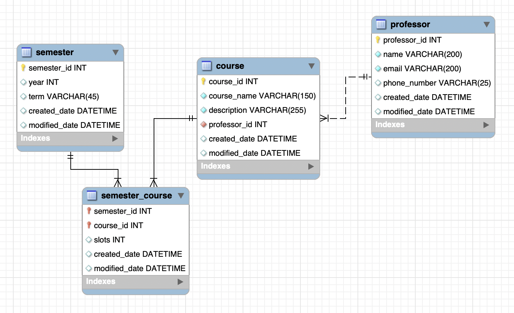

# Homework 2 (10 credits)

## Parte 1 - Web (5 credits)

El uso de una página web como carta de presentación permite a los programadores dar una prueba clara y directa de sus habilidades.

Por esa razón, en esta tarea cada uno de ustedes se creará su propia página web.

### Requisitos

Su página web debe de (al menos), tener la siguiente estructura:


### Rúbrica

#### H1, H2 y Listas (1pto)

- Uso de H1 centrado para el título y H2 subrayado para los subtitulos.
- Parrafo con descripción sobre ti.
- Una lista ordenada con la información que desees.

#### Link y separaciones (1pto)

- Link que manda a su repositorio de github.
- Separación de secciones por una línea horizontal

#### Imágenes (1pto)

- Incluir una imagen **centrada horizontalmente**

#### Color de fondo (1pto)

- Color de fondo (o fondo de libre elección)

#### Mensaje de saludo (1pto)

- Botón que ejecuta una función en javascript que ejecuta un `alert` diciendo su nombre y mostrando su correo.

Es libre llevar el diseño de su página web más allá de lo solicitado.

Finalmente, publique su página web usando [GitHub pages](../../Labs/Lab2/github_page_101.md) (-50% de puntos si no lo publica).

La manera de desarrollar la tarea es libre con tal que cumpla **visualmente** con los requisitos.

### Submission

Suba el link de su página web en la plataforma del curso.

## Parte 2 - SQL (5 puntos)

Ingrese los comandos (en el orden en que yo debo ejecutarlos) para crear la siguiente estructura de base de datos **MySQL** con los registros para cada tabla en una base de datos llamada `university`:



Los detalles de cada tabla se muestra a continuación

```
mysql> show tables;
+----------------------+
| Tables_in_university |
+----------------------+
| course               |
| professor            |
| semester             |
| semester_course      |
+----------------------+
4 rows in set (0.00 sec)
```

### Tabla cursos (1pto)

```
mysql> desc course;
+---------------+--------------+------+-----+---------+----------------+
| Field         | Type         | Null | Key | Default | Extra          |
+---------------+--------------+------+-----+---------+----------------+
| course_id     | int          | NO   | PRI | NULL    | auto_increment |
| course_name   | varchar(150) | NO   |     | NULL    |                |
| description   | varchar(255) | NO   |     | NULL    |                |
| professor_id  | int          | YES  | MUL | NULL    |                |
| created_date  | datetime     | YES  |     | NULL    |                |
| modified_date | datetime     | YES  |     | NULL    |                |
+---------------+--------------+------+-----+---------+----------------+
6 rows in set (0.00 sec)
```

### Tabla professor (1pto)

```
mysql> desc professor;
+---------------+--------------+------+-----+---------+----------------+
| Field         | Type         | Null | Key | Default | Extra          |
+---------------+--------------+------+-----+---------+----------------+
| professor_id  | int          | NO   | PRI | NULL    | auto_increment |
| name          | varchar(200) | NO   |     | NULL    |                |
| email         | varchar(200) | NO   |     | NULL    |                |
| phone_number  | varchar(25)  | YES  |     | NULL    |                |
| created_date  | datetime     | YES  |     | NULL    |                |
| modified_date | datetime     | YES  |     | NULL    |                |
+---------------+--------------+------+-----+---------+----------------+
6 rows in set (0.01 sec)
```

### Tabla semester (1pto)

```
mysql> desc semester;
+---------------+-------------+------+-----+---------+----------------+
| Field         | Type        | Null | Key | Default | Extra          |
+---------------+-------------+------+-----+---------+----------------+
| semester_id   | int         | NO   | PRI | NULL    | auto_increment |
| year          | int         | YES  |     | NULL    |                |
| term          | varchar(45) | YES  |     | NULL    |                |
| created_date  | datetime    | YES  |     | NULL    |                |
| modified_date | datetime    | YES  |     | NULL    |                |
+---------------+-------------+------+-----+---------+----------------+
5 rows in set (0.00 sec)
```

### Tabla semester_course (1pto)

- Los primary key `semester_id` y `course_id` son foreigb keys de las tablas `semester` y `course` respectivamente.

```
mysql> desc semester_course;
+---------------+----------+------+-----+---------+-------+
| Field         | Type     | Null | Key | Default | Extra |
+---------------+----------+------+-----+---------+-------+
| semester_id   | int      | NO   | PRI | NULL    |       |
| course_id     | int      | NO   | PRI | NULL    |       |
| slots         | int      | YES  |     | NULL    |       |
| created_date  | datetime | YES  |     | NULL    |       |
| modified_date | datetime | YES  |     | NULL    |       |
+---------------+----------+------+-----+---------+-------+
5 rows in set (0.00 sec)
```

### Insertar valores (1 punto)

Insertar al menos una fila, sin ningún valor NULL, en cada una de las tablas. Incluir los inserts en su archivo `.sql` 


### Tips

- Recomendamos que primero escriba sus comandos en un archivo separado, y vaya copiando y pegando sus comandos en el terminal para probarlos.

- Para hacer el test final, recomendamos que borre la base de datos que creó, y copie y pegue sus comandos en el orden para probar que no se le olvida nada.

- No se olvide del comando inicial para crear la base de datos! (`create database ...`).

### Submission

Incluya todos sus comandos en un archivo llamado `university.sql`. Incluya los comandos para:

1. Crear la base de datos
2. Crear las tablas
3. Insertar los datos

Suba el archivo `university.sql` a la plataforma del curso.

### Grading criteria

Vamos a probar sus comandos en el orden que usted los mandó. Si uno de sus comandos falla, pararemos la correción en ese punto 😰. En otras palabras, el resto de comando no recibirán ningún punto.

Nuevamente le recordamos que no se olvide de incluir el comando para crear la base de datos (`create database ...`)

## Fecha límite

Entregar a más tardar el 21 de Setiembre a las 11:59pm