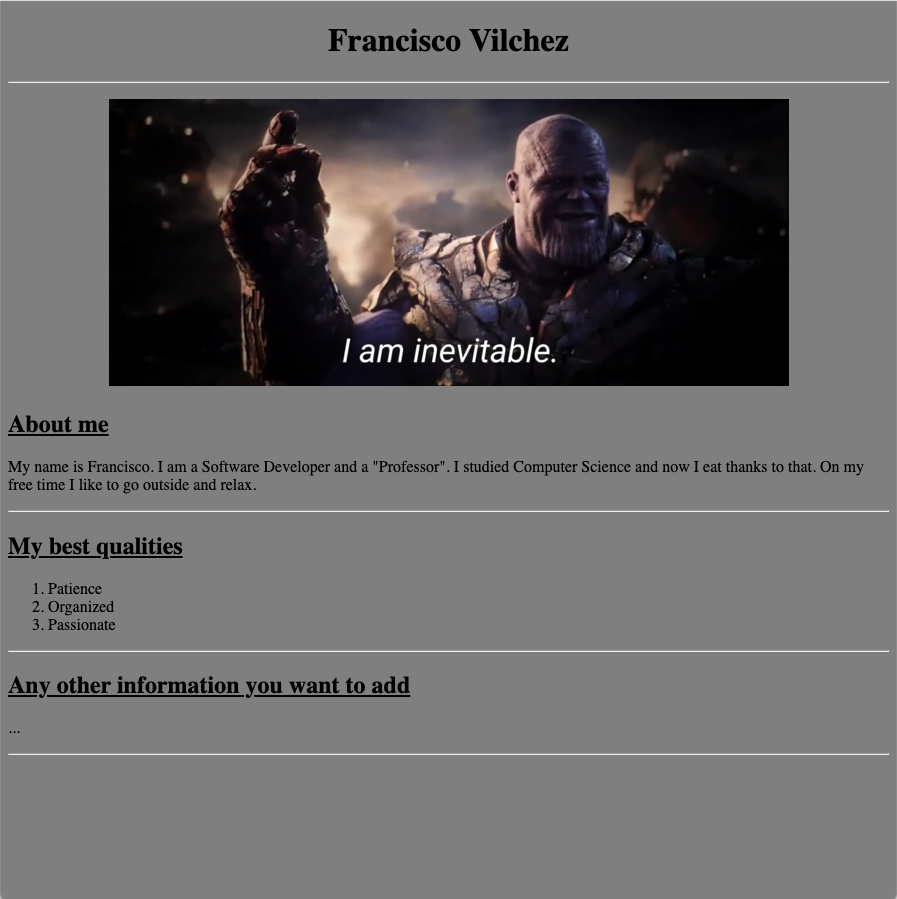

# Homework 2 (5 puntos)

El uso de una página web como carta de presentación permite a los programadores dar una prueba clara y directa de sus habilidades.

Por esa razón, en esta tarea cada uno de ustedes se creará su propia página web.

## Requisitos

Su página web debe de (al menos), tener la siguiente estructura:

### Rúbrica

### H1, H2 y Listas (1pto)

- Uso de H1 centrado para el título y H2 subrayado para los subtitulos.
- Parrafo con descripción sobre ti.
- Una lista ordenada con la información que desees.

### Link y separaciones (1pto)

- Link que manda a su repositorio de github.
- Separación de secciones por una línea horizontal

### Imágenes (1pto)

- Incluir una imagen **centrada horizontalmente**

### Color de fondo (1pto)

- Color de fondo (o fondo de libre elección)

### Mensaje de saludo (1pto)

- Botón que ejecuta una función en javascript que ejecuta un `alert` diciendo su nombre y mostrando su correo.

Es libre llevar el diseño de su página web más allá de lo solicitado.

Finalmente, publique su página web usando [GitHub pages](../../Labs/Lab2/github_page_101.md) (-50% de puntos si no lo publica).

La manera de desarrollar la tarea es libre con tal que cumpla **visualmente** con los requisitos.

## Submission

Suba el link de su página web en la plataforma del curso.

## Fecha límite

Entregar a más tardar el 20 de Setiembre a las 11:59pm