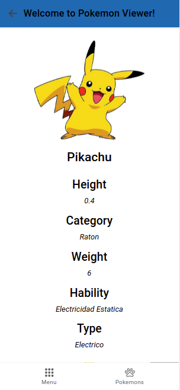
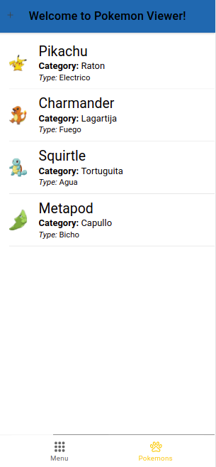

# Parte 2(15 puntos)
Deberá crear un proyecto en Ionic con las siguientes vistas:

- Home `/`: Creación de una vista de bienvenida. Activable con un tab "Home".
- Listar, `/pokemon`: Creación de una vista de Ionic en el cual se liste los pokemons. Activable con un tab "Pokemons".
- Ver, `/pokemon/:id`: Ver la data de un pokemon. Abajo habra 2 botones (Delete y Edit). Delete redirecciona a `/pokemons/delete/:id`. Edit redirecciona a `/pokemons/edit/:id`.
- Create, `/pokemon/new`: Form para crear un pokemon (Se va a activar al darle click a un boton `+` en la esquina superior izquierda).
- Delete `/pokemon/delete/:id`: Pantalla donde se muestra un mensaje de confirmacion para eliminar a un pokemón.
- Update `/pokemon/edit/:id`: Pantalla con un form para editar un pokemon.

## Ejemplo
El diseño de la aplicación queda a su **libre creatividad**. La imágenes son referenciales. 

| Bienvenida  | Data de un pokemón    | Lista de pokemones  |
|-------------|-----------------------|---------------------|
||||

