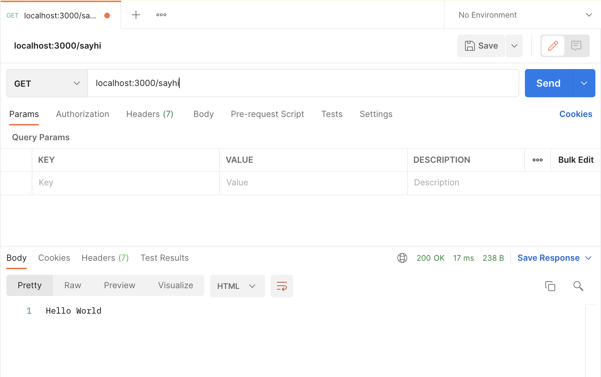

# Creating APIs in NodeJS

For this guide, we will use `express` to create the APIs.

## Installation

We begin creating a folder for working this guide and installing the `express` library.

```
mkdir myapi
cd myapi
touch index.js
npm init
code .
```

Now we have our project opened with VSCode. Let go back to the terminal and install our `express` module.

```
npm install express --save
```

Let begin by creating a basic API that returns a "Hello World!" message. We will use this using the [syntax provided by express](https://expressjs.com/en/starter/hello-world.html).

## Breaking down (and tunning) the express `hello world` example

Let's start editing our `index.js` file. The first thing we need to do is import the express module. We will use the old notation for importing modules, in other words, we will use the `require` statement for importing modules.

```
// index.js
const express = require('express');
```

After that, let's create the app with the `express` function that we imported.

```
const app = express();
```

The variable `app` will contain the definitions of our APIs and the details of the Application Server that is going to run them, for example, the port number. Let's store that value in a variable so we can use it later.

```
const port = 3000;
```

Let's start by defininf an API linked to a function that returns `Hello World!`. The function will be executed when we run `GET /sayhi`.

Let's start by linking the URL and the function.

```
app.get('sayhi', helloworld);
```

The function that will run for a specific URL, is also known in `express` as the *callback function*. It means "the function that will be executed".

Now, let's define the function. Since the function is going to be executed by the `express` framework when a URL is invoked, we can receive two parameters in there:

- `req`: Store details of the request, for example, the IP of the computer that made the request, data sent from the client, etc.

- `res`: It's a variable that will be used to send the response to the client. Specifically, its function `send()`. We will include the response inside the parantesis of the `send` function.

```
function helloworld(req, res){
  // Your code ...
}
```

Now we can use the function `send` to return a response. Let's return "Hello World".

```
function helloworld(req, res){
  res.send("Hello World");
}
```

Finally, we need to tell the `app` in which port will it run. Let's use the variable `port` that we defined before...


As you can see, we have specified the function `serverCreated` as the *callback function* for the app server configuration. In other words, the `serverCreated` function will be executed when the `app` is initialized succesfully.

In express (and in javascript in general) you will use *callback functions* A LOT. They represent *the function that is executed when something finishes successfully*.

One way to avoid the definition of a function, is to use an *anonymous function*. An anonymous function is declared in the same place where it would be invoked. For example, instead of having the create a function `serverCreated` we could just had done:


```
app.listen(port, function(){
  // here goes the code you were going
  // to include in your function serverCreated
})
```

Another syntax for creating anonymous functions is the next one:

```
app.listen(port, () => {
  // here goes the code you were going
  // to include in your function serverCreated
})
```

## Testing our API

We will use Postman for this. Let's open Postman and use the following information:

- Method: `GET`
- Hostname: `localhost:3000`
- Endpoint: `/sayhi`


