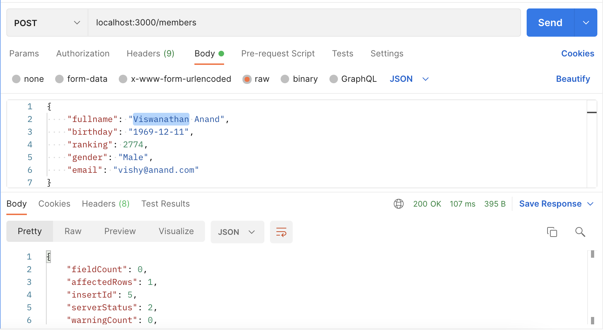
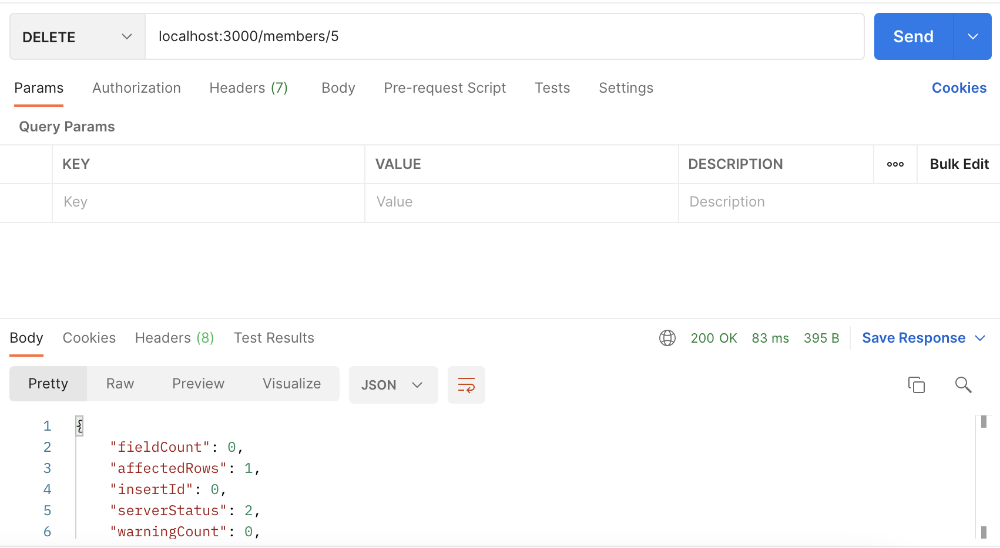
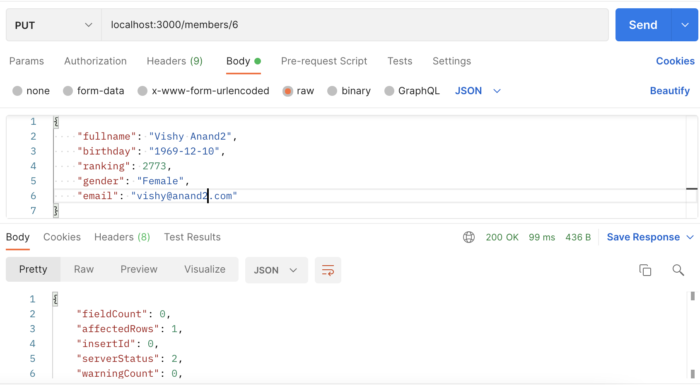

# Creating a CRUD API with Express

Our CRUD (Create, Read, Update, Delete) API, will allow us to:

- Create a new chess member for the club
- Read the chess members
- Update a chess member information
- Delete a chess member ([Is this really a delete?](https://en.wikipedia.org/wiki/Right_to_be_forgotten#:~:text=The%20right%20to%20be%20forgotten,EU%2C%20and%20the%20Philippines.))

The respective endpoints will be:

-----------------------------------
| Endpoint | Method | Description |
|-----------|---------|------------|
| `/members` | `GET` | Read members |
| `/members` | `POST` | Add a new member |
| `/members` | `PUT` | Update member's information |
| `/members` | `DELETE` | Delete a member |

## `POST /members`

Let's start using more anonymous functions for this example. We will start defining the endpoint for our `app` in Express and attach an anonymouns function as the `callback` instead of a separate function like previous examples.

```javascript
app.post('/members', function(req, res){
    // Handle the HTTP request here
});
```

As we know, the data is going to come in the `req.body` attribute, so we will use that to create the query for inserting the data in our DB.

For our project, we will receive the data as a `json`. We can tell that to our app by including the following line before our APIs definition:

```javascript
app.use(express.json());
```

Otherwise, we will have to parse the text in json format that was received in `req.body` into a Javascript object by ourselves.

### SQL query for `POST /members`

Our query will look like this:

```sql
INSERT INTO member (fullname, birthday, ranking, gender, email)
VALUES ('Viswanathan Anand', '1969-12-11', 2774, 'Male', 'vishy@anand.com', NOW(), NOW());
```

However, the values will be received in the `req.body`. Because of that, we will use `?` instead of the actual value, and we will pass all the values in an array to the `mysql` library.

```sql
INSERT INTO member (fullname, birthday, ranking, gender, email, created_date, modified_date )
VALUES (?, ?, ?, ?, ?, NOW(), NOW());
```

### API definition for `POST /members`

Now we can include the same steps as previous APIs for inserting into the DB from our Node.js project:

```javascript
app.post('/members', function(req, res){
     // Step 0: Definir la conexion a la BD
     var connection = mysql.createConnection({
        host: 'localhost',
        user: 'utec',
        password: '1234567890',
        database: 'my_chess_club'
    });

    // Step 1: Establecer la conexion
    connection.connect();

    // ;Step 2: Mandar el query
    var myQuery =   " INSERT INTO member (fullname, birthday, ranking, " +
                    " gender, email, created_date, modified_date ) " +
                    " VALUES (?, ?, ?, ?, ?, NOW(), NOW()); ";

    var myValues = [req.body.fullname, req.body.birthday, req.body.ranking, req.body.gender, req.body.email ];

    connection.query(myQuery, myValues, function(error, results, fields){
        // Ya tengo el resultado del query en `results`. Si hay algun error, llegará en `error`
        if (error) throw error;
        
        // Step 3: Procesar el resultado de la BD
        res.send(results);

        // Step 4: Cerrar la conexion
        connection.end();
    });
});
```

Notice we are now including the next statement in the callback since we may start running into issues while coding:

```javascript
if (error) throw error;
```

We are also including the attributes that we want to insert in `myValues` as a second argument. The `mysql` is smart enough to detect that as the values that will be inserted.

### Postman request for `POST /members`

Now we can make the HTTP call using Postman.



We are including the following `json` in the body. Make sure to mark its type as `JSON` in POSTMAN:

```json
{
  "fullname": "Viswanathan Anand",
  "birthday": "1969-12-11",
  "ranking": 2774,
  "gender": "Male",
  "email": "vishy@anand.com"
}
```

## `DELETE /members`

For the `DELETE` method, we will receive the value that we will delete in the params. For example, if we want to delete the member with the `member_id` whose value is 5, we will need to call the following method:

```
DELETE /members/5
```

The way we define an API with that format in express is shown below:

```
app.delete('/members/:member_id', function(req, res){
  // the member_id value will be received in req.params.member_id
});
```

We could have used any name for the variable.

### API definition for `DELETE /members`

The next thing to do, will be the same as previous endpoints, figure out our delete SQL command and include in the node.js with the same standards as the previous endpoints. The result is shown below:

```javascript
// Step 0: Definir la conexion a la BD
var connection = mysql.createConnection({
  host: 'localhost',
  user: 'utec',
  password: '1234567890',
  database: 'my_chess_club'
});

// Step 1: Establecer la conexion
connection.connect();

// ;Step 2: Mandar el query
var myQuery = " DELETE FROM member " +
              " WHERE member_id = ?; ";

var myValues = [ req.params.member_id ];

connection.query(myQuery, myValues, function(error, results, fields){
  // Ya tengo el resultado del query en `results`. Si hay algun error, llegará en `error`
  if (error) throw error;
  
  // Step 3: Procesar el resultado de la BD
  res.send(results);

  // Step 4: Cerrar la conexion
  connection.end();
});
```

### Postman request for `DELETE /members`



## `PUT /members`

As we remember, we will use params and the body for the `PUT` request.

- params: will have the value of the `member_id` we want to update.
- body: will have the values that will be updated.

That means that our API will be called in the following way:

```
PUT /members/6

Body:
{
  "fullname": "Vishy Anand",
  // ... any other fields that want to be updated
}
```

The way we define the PUT api is shown below:

```javascript
app.put('/members/:member_id', function(req, res){
  // member_id will be received in req.params.member_od
  // the values to be updated will be received in req.body
});
```

### SQL command for `PUT /members`

The next thing to do, will be the same as previous endpoints, figure out our update SQL command and include in the node.js with the same standards as the previous endpoints. 

Since the values to be updated in the SQL depend on the values included in the JSON, our SQL will have to be created dinamically.

```sql
UPDATE member
SET modified_date = NOW(),
    fullname = 'Vishy Anand',
    email = 'vishy@anand.net',
    // other fields...

WHERE member_id = 6;
```

The logic for creating that SQL in javascript, taking in consideration is will be done dinamically, that is shown bellow:

```javascript
  // Initialize myQuery with a initial UPDATE statement
  var myQuery = " UPDATE member SET modified_date = NOW() ";

  // The values to be updated will be included in myValues array
  var myValues = [ ];
  
  // We start checking if we received a field in the body
  if (req.body.fullname ){

    //if the field was received, we add it to the query and to the array with values
    myQuery += " , fullname = ? ";
    myValues.push(req.body.fullname);
  }

  // We end the query specifying the id we want to update
  myQuery += " WHERE member_id = ? "
  myValues.push(req.params.member_id);
```

There are more fancy ways to make that statement. Also, some people prefer to use ORMs, which are libraries that help them in the creation of those complex queries and you just need to pass them the values.

### API definition for `PUT /members`

Following our approach, we continue adding all the fields that we want to receive in the HTTP call. The result is shown below:

```javascript
app.put('/members/:member_id', function(req, res){
  // Step 0: Definir la conexion a la BD
  var connection = mysql.createConnection({
    host: 'localhost',
    user: 'utec',
    password: '1234567890',
    database: 'my_chess_club'
  });

  // Step 1: Establecer la conexion
  connection.connect();

  // Step 2: Mandar el query
  var myQuery = " UPDATE member SET modified_date = NOW() ";
  var myValues = [ ];
  
  if (req.body.fullname){
    myQuery += " , fullname = ? ";
    myValues.push(req.body.fullname);
  }

  if (req.body.birthday){
    myQuery += " , birthday = ? ";
    myValues.push(req.body.birthday);
  }

  if (req.body.ranking){
    myQuery += " , ranking = ? ";
    myValues.push(req.body.ranking);
  }

  if (req.body.gender){
    myQuery += " , gender = ? ";
    myValues.push(req.body.gender);
  }

  if (req.body.email){
    myQuery += " , email = ? ";
    myValues.push(req.body.email);
  }

  myQuery += " WHERE member_id = ? "
  myValues.push(req.params.member_id);

  connection.query(myQuery, myValues, function(error, results, fields){
    // Ya tengo el resultado del query en `results`. Si hay algun error, llegará en `error`
    if (error) throw error;
    
    // Step 3: Procesar el resultado de la BD
    res.send(results);

    // Step 4: Cerrar la conexion
    connection.end();
  });
});
```

### Postman request for `PUT /members`



## `GET /members`

We already have out `GET /members` service created, however, let's enhance it a bit more. Usually, the values received in the querystring for a GET service is used to filter the results shown. It is up to you decide which filters you want to include. For example, the following HTTP request:

```
GET /members?ranking_ht=2000
```

Could return the players with ranking higher than 2000. Or we can also do:

```
GET /members?ranking_lt=2000
```

Which could return the players with ranking lower than 2000. The name of the variables received in the querystring can be customized according to your requirements. For example, if you want to also filter by gender, you can receive a parameter like this:

```
GET /members?gender=female
```

Which will return the members identified with the female gender. You can also pass multiple values in the query string using the following format:

```
GET /members?ranking_ht=2000&gender=female
```

THe way API will receive those values is in the following way:

```javascript
app.get('/members', function(req, res){
  // ranking_ht and gender variables are available in req.query
});
```

### SQL command for `GET /members`

As we remember, the filters are included in the `WHERE` clause of our `SELECT` command:

```sql
SELECT member_id, fullname, birthday, ranking, gender, email, created_date, modified_date
FROM member
WHERE ranking > 2000
AND UPPER(gender) = UPPER('female');
```

Notice we are uppercasing the gender so we don't have issues with upper or lower case.

Now we need to dinamically append those conditions in our `WHERE` clause. One (probably fancy) way to do this is in the following way:

```javascript
var myQuery = " SELECT member_id, fullname, birthday, ranking, " +
                " gender, email, created_date, modified_date " +
                " FROM member " +
                " WHERE 1 = 1";
  var myValues = [];

  if(req.query.ranking_ht){
    myQuery += " AND ranking > ? ";
    myValues.push(ranking_ht);
  }

  if(req.query.ranking_lt){
    myQuery += " AND ranking < ? ";
    myValues.push(ranking_lt);
  }

  if(req.query.gender){
    myQuery += " AND UPPER(gender) = UPPER(?) ";
    myValues.push(gender);
  }
```

As we can see, in order to easily append each filter in our `WHERE` clause, we are including an elegant `1 = 1`, which will always be true. Because of that, it doesn't affect in anything to our query.

### API definition for `GET /members`

Our `GET /members` api definition can now be changed to the following approach:

```javascript
app.get('/members', function(req, res){
  // Step 0: Definir la conexion a la BD
  var connection = mysql.createConnection({
    host: 'localhost',
    user: 'utec',
    password: '1234567890',
    database: 'my_chess_club'
  });

  // Step 1: Establecer la conexion
  connection.connect();

  // Step 2: Mandar el query
  var myQuery = " SELECT member_id, fullname, birthday, ranking, " +
                " gender, email, created_date, modified_date " +
                " FROM member " +
                " WHERE 1 = 1";
  var myValues = [];

  if(req.query.ranking_ht){
    myQuery += " AND ranking > ? ";
    myValues.push(req.query.ranking_ht);
  }

  if(req.query.ranking_lt){
    myQuery += " AND ranking < ? ";
    myValues.push(req.query.ranking_lt);
  }

  if(req.query.gender){
    myQuery += " AND UPPER(gender) = UPPER(?) ";
    myValues.push(req.query.gender);
  }

  connection.query(myQuery, myValues, function(error, results, fields){
    // Ya tengo el resultado del query en `results`. Si hay algun error, llegará en `error`
    if (error) throw error;
    
    // Step 3: Procesar el resultado de la BD
    res.send(results);

    // Step 4: Cerrar la conexion
    connection.end();
  });
});
```

## Postman request for `GET /members`


## `GET /members/:member_id`

There is another additional API is usually defined, which is the one that returns a **single member** based on the member_id passed in the params. The difference with `GET /members` is that in `GET /members/:member_id` **we will now return a single element**, while the `GET /members` always returns an array of elements based on the filters.

The API will be called in the following way:

```
GET /members/6
```

Which will return the member with `member_id` equal to one.

The definition of the API is defined bellow:

```javascript
app.get('/members/:member_id', function(req, res){
  // Step 0: Definir la conexion a la BD
  var connection = mysql.createConnection({
    host: 'localhost',
    user: 'utec',
    password: '1234567890',
    database: 'my_chess_club'
  });

  // Step 1: Establecer la conexion
  connection.connect();

  // Step 2: Mandar el query
  var myQuery = " SELECT member_id, fullname, birthday, ranking, " +
                " gender, email, created_date, modified_date " +
                " FROM member " +
                " WHERE member_id = ? ";
  var myValues = [req.params.member_id];

  connection.query(myQuery, myValues, function(error, results, fields){
    // Ya tengo el resultado del query en `results`. Si hay algun error, llegará en `error`
    if (error) throw error;
    
    // Step 3: Procesar el resultado de la BD
    res.send(results[0]);

    // Step 4: Cerrar la conexion
    connection.end();
  });
});
```

Notice that we are returning `results[0]`, since the `mysql` library always return an array, but we want to just return the single element that is returned by our query.

### Postman request for `GET /members/:member_id`


## Note

So far, we are not handling validations or possible errors that can occur in our application.

Code created in this guide is available in [code_sample](./code_sample) directory
