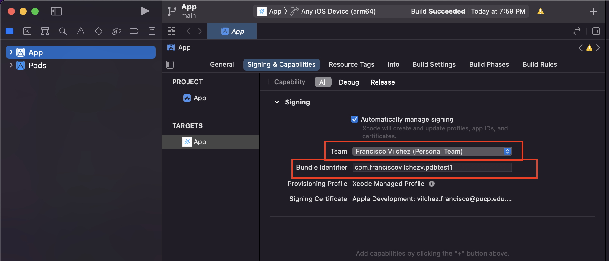

# Deployment in Simulator or Device

First we need the following dependencies:

```
npm install -g @ionic/cli native-run cordova-res
```

For deploying our app in a mobile device, we need to first build the project

```
ionic build
```

## iOS

We generate the iOS project

```
ionic cap add ios
```

And we can open the project in Xcode with the following command:

```
ionic cap open ios
```

You can read the following [link](https://github.com/franciscovilchezv/coding-in-apple-silicon/blob/main/ionic/README.md) for common issues when installing dependencies or generation iOS project.

### Some addional setups

- If you want to deploy the app in you mobile device, you will need to create a team and select a valid bundle name



- Additionally, in your mobile device, you must trust the application deployed under `Settings > Configuration > Profile and Device`.

## Android

You may have to install [the following dependency](https://stackoverflow.com/a/65372165/4962221) before anything.

We generate the Android project

```
ionic cap add android
```

We can now open the project in [Android Studio](https://developer.android.com/studio?gclid=Cj0KCQiAkNiMBhCxARIsAIDDKNUx9TLc3zzCN5zmWBQYX_QeXS4pUdxKdQkfteL5TTH4H03Pkho9Wx4aAuPoEALw_wcB&gclsrc=aw.ds#downloads) with the following command:

```
ionic cap open android
```
