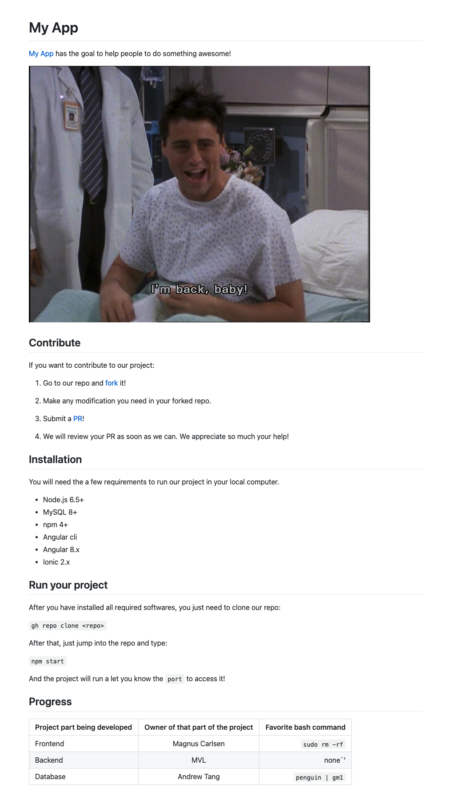

# PC 1 (10 puntos)

Tiempo disponible: 120 minutos

Reglas: Puede utilizar diapositivas, internet, google, youtube, dota, etc... **La única regla es no copiar, "conversar", ni compartir información con compañeros u otras personas. La prueba es estrictamente individual.**

## Pregunta 1 (3 puntos)

### ¿Cuál es la diferencia entre IP, TCP y UDP?

Esta pregunta permitirá corroborar sus conocimientos de redes de computadoras necesarios para el curso.

Para obtener puntaje completo, usted deberá:

- Explicar con sus propias palabras la diferencia entre IP, UDP y TCP. **(1 punto)**

- Mencionar un ejemplo **real** en el cual se utilice el protocolo UDP y otro en el que se utilice el protoco TCP explicando la razón por la cuál usted considera que se utilizan cada uno de esos protocolos para cada ejemplo dado. **(1 punto)**

- Muestre la diferencia entre un paquete de datos UDP y uno TCP a través de gráficos. Explique su respuesta. **(1 puntos)**

Escriba su respuesta en un archivo llamado `pregunta1.md`

## Pregunta 2 (4 puntos)

La [aparición de contagios COVID-19 en personas vacunadas](https://scdhec.gov/covid19/covid-19-data/breakthrough-cases-tracking-disease-infection-after-vaccination) es un tema que está preocupando a la sociedad. Por esa razón, entidades están midiendo [cómo es que se están comportando las vacunas fuera de los ensayos clínicos](https://www.cdc.gov/coronavirus/2019-ncov/vaccines/effectiveness/why-measure-effectiveness.html). En otras palabras, en "la vida real".

Una joven peruana, especialista en diseño de base de datos, ha propuesto un modelo de base de datos para una App que le permitirá a la población reportar un caso de COVID-19 detallando la vacuna que ha recibido. Sin embargo, no ha tenido tiempo de escribir las sentencias SQL para crear la estructura de la base de datos. Un diseño inicial de la base de datos que permite registrar los reportes ha sido subido a su [repositorio de GitHub](https://github.com/franciscovilchezv/the-covid-vaccine-effectiveness). *(Imaginemos que la joven peruana es @franciscovilchezv).*

Usted se ha ofrecido para crear dichas sentencias y de esta manera, contribuir al proyecto de código abierto, el cual podrá ser construido en equipo por diversas programadoras y programadores del Perú.

Su misión es:

1. Haga un `fork` del repositorio original y agregue su usuario de GitHub donde dice "Administrador de la Base de Datos". `"pushee"` sus cambios, y mande un `pull request` para que incluyan su modificación en el repositorio original. (1 punto)

2. Escriba los comandos SQL para la creación de la estructura de la base de datos llamada `covid_reports` y de las tablas. Guárdelo en un archivo llamado `pregunta2.sql`. (1.5 puntos)

3. Incluya al final del mismo archivo `pregunta2.sql` los inserts necesarios para registrar la siguiente información (1.5 puntos):

*El ciudadano Alireza Firouzja con número de pasaporte (passport) 987654321 tuvo su primera dosis de la vacuna Pfizer el 1 de Febrero del 2021 y la segunda el 25 de Febrero del 2021. A pesar de ello, acaba de dar positivo para COVID y reporta que el único lugar público en el que se encontró fue Plaza San Miguel (lat: -12.076778, long: -77.0852847) el 22 de setiembre del 2021 a las 10:59am*

Tip 1: Utilize la función `NOW()` para completar los valores de `created_date` y `modified_date`.

Tip 2: Para evaluar que usted puede ampliar sus conocimientos de base de datos (en este caso, usando MySQL), se le brinda la [documentación de ENUM](https://dev.mysql.com/doc/refman/8.0/en/enum.html) para que aprenda cómo utilizarlo.

Tip 3: Si no sabe cómo insertar algún valor en específico, recuerde que tiene permitido usar Google 🕵️, como por ejemplo [¿Cómo insertar DATETIME en MySQL?](https://www.google.com/search?q=insert+datetime+mysql&oq=insert+datetime+mysql&gs_lcp=Cgdnd3Mtd2l6EAMyBAgjECcyBggAEAcQHjIGCAAQBxAeMgYIABAHEB4yBggAEAcQHjIGCAAQBxAeMgYIABAHEB4yBggAEAcQHjIGCAAQBxAeMgYIABAHEB46BwgjELADECc6BwgAEEcQsAM6BwgAELADEEM6BwgjELACECc6BAgAEA06BggAEA0QHjoICAAQDRAFEB46BQgAEIAESgQIQRgASgQIQRgAUKxUWJBtYICFAWgEcAJ4AIABYogBngeSAQIxMZgBAKABAcgBCsABAQ&sclient=gws-wiz).

Tip 4: Se detendrá la calificación en el momento en que uno de sus comandos retorne un error. Por lo tanto, asegúrese de incluir todos los comandos necesarios y en el orden debido.

## Pregunta 3 (1 punto)

Replique el siguiente README.md utilizando el [Markdown de Github](https://docs.github.com/en/github/writing-on-github/getting-started-with-writing-and-formatting-on-github/basic-writing-and-formatting-syntax).

Información adicional:

- Los links pueden redireccionar a cualquier url que usted desee.

- Puede obtener la imagen del siguiente link: 

https://pbs.twimg.com/media/CDdIu4TWIAEKAFr?format=jpg&name=900x900

## Pregunta 4 (2 puntos)

Explique la diferencia entre una página web y una aplicación web (1 punto) e incluya un ejemplo de cada uno de ellos (1 punto).

## Trabajos a entregar:

- Su repositorio deberá tener sus archivos `pregunta1.md`, `pregunta2.sql`, `pregunta3.md`, `pregunta4.md`. Si utilizó alguna imagen, asegúrese de que esté incluida en el repositorio o esté disponible.

- No se olvide de colocar el link de su `Pull Request` de la pregunta 2 en el README.md de su repositorio.

- Suba el link de su repositorio a la plataforma del curso.
